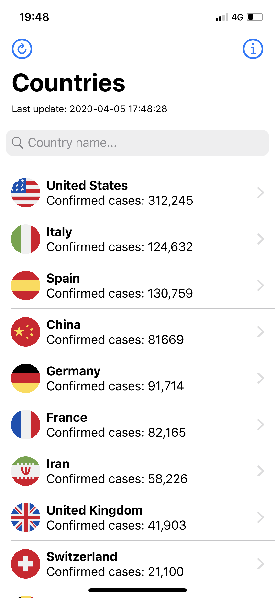
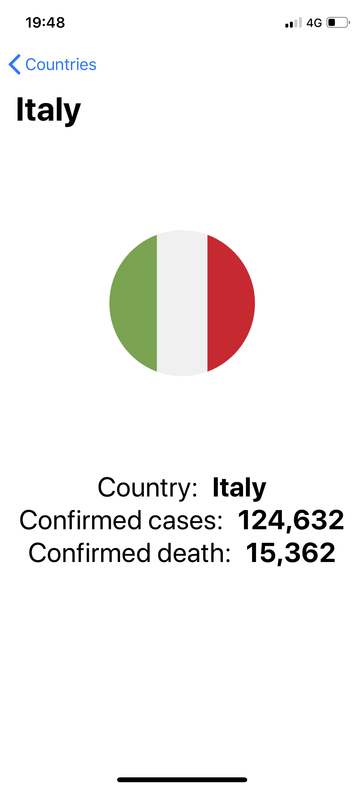

# Covid-19 Map
This iOS App tracks Covid-19 data

Covid-19 Map has been developed for information purposes only.

Data provider: channelnewsasia.com

> Note: This is my first time using API in Swift. This project was born as an exercise to learn how to use them. In fact, the UI sucks 🤪

# App Preview
Countries List View      |   Details View
:-------------------------:|:-------------------------:
  |  
